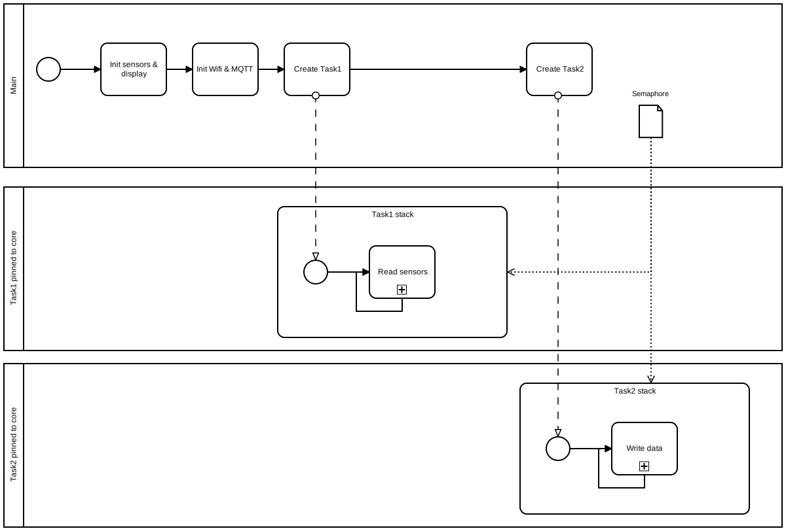

## ESP32 Tiny Weather Station

The project uses inexpensive components to build a small weather station. The MCU consists of an ESP32 WROOM32. DHT11 and BMP180 are used as sensors. As display the cheap SH1106 is used. All sensor data are transmitted to a MQTT server.
The software is designed so that you do not necessarily need all components.
For example, you can configure the weather station without display or without humidity sensor.
The project uses the esp-idf tool V4.3 with support files for the Espressif Visual Studio Code extension.

The software is not designed for maximum efficiency. It uses a FreeRTOS task implementation to read sensor data and output the data via serial interface, MQTT and display.

### SH1106 OLED Display

### Circuit Diagram

### Software Diagram

